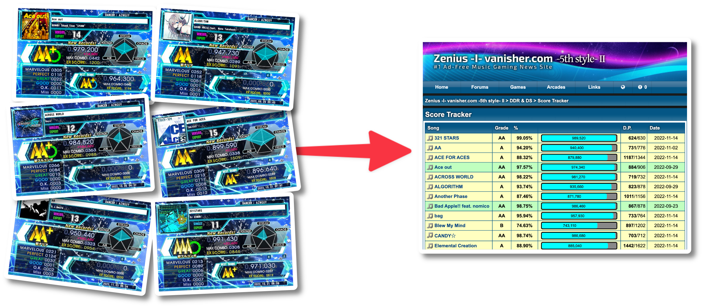
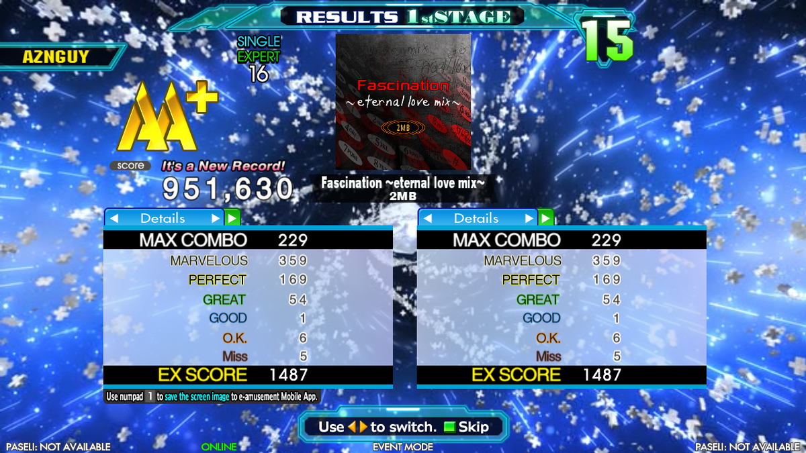

# [EATZ](https://aznguy.com/eatz/) (e-amusement to zenius)
Efficiently upload **DDR e-amusement PlayShare** (プレーシェア) screenshots to [ZiV DDR Score Tracker](https://zenius-i-vanisher.com/v5.2/ddrscoretracker.php?function=enterscore).

### Latest Version (FULLY) Supported: DDR A20 PLUS
##### DDR A3 is partially supported (some new songs won't be recognized.)

## Notes
- ❗️❗️❗️ Uploading scores to ZiV with EATZ does involve pasting console commands, but it is 100% safe! If you're still unsure, this project is open-source so you can look at the code.
- EATZ uses [tesseract.js](https://github.com/naptha/tesseract.js) (compiled with [browserify](https://github.com/browserify/browserify)) to scan your screenshots for data, such as song names, judgement counts, etc.
- EATZ currently doesn't scan for chart modifiers (speed mod, boost, turn, etc.), so x1.5  and Note  will be selected by default.
- Compatible with both [DDR-A-Type](https://imgur.com/a/krUPbNo) and [DDR-2014-Type](https://media.discordapp.net/attachments/860985407452479508/1044055060671385651/unknown.png) screenshot formats.
- Does not support Courses.
- Does not support failed scores. ()
- There may be some songs that EATZ can't recognize when scanning screenshots. It doesn't happen very often but unfortunately, you'll have to enter those outliers manually.

## Usage

1. [Setting up PlayShare](#setting-up-playshare)
2. [Accessing the Screenshots](#accessing-the-screenshots)
3. [Using EATZ and Uploading to ZiV](#using-eatz-and-uploading-to-ziv)

## Setting up PlayShare
1. Download **[e-amusementアプリ](https://eam.573.jp/app/web/howto/?page=playshare.html&share_game=ddr)** on your [iOS](https://apps.apple.com/jp/app/id680436505) or [Android](https://play.google.com/store/apps/details?id=jp.konami.eam.link) device.
2. Log into your KONAMI ID Account that is linked to your e-amusement card you use when playing DDR at the arcade.
3. After logging in, you will unlock the feature to save in-game screenshots when playing DDR by pressing 1️⃣ on the numpad at the results screen:

## Accessing the Screenshots
When playing DDR, pressing 1️⃣ at the results screen will send the image to your account. To access the image(s), do the following:

## Using EATZ and Uploading to ZiV
1. On EATZ, upload PlayShare screenshot files or paste image/tweet URLs that contain PlayShare screenshots.
2. Click **Generate** to scan the screenshots and generate the console command(s).
3. Once generated, double check the code and make any corrections if there are misdetected songs.
4. Click **Select All** at the top, and copy all the text in the code block.
5. Head over to the [ZiV DDR Score Tracker](https://zenius-i-vanisher.com/v5.2/ddrscoretracker.php?function=enterscore) website and <ins>make sure you're logged in</ins>.
6. Open DevTools; There are many methods to do so:
	1. Use `F12`.
	2. Right click anywhere and click `Inspect Element`.
	3. Use `Ctrl+Shift+I` if on Windows.
	4. Use `Command+Option+I` if on macOS.
	- If you can't open DevTools on Safari, enable Developer mode: `Command+,`>`Advanced`>`Show Develop menu`
7. Open the `Console` tab in DevTools
8. Paste the command. __If you used local file uploads, read the next step.__ Otherwise, you're done!
### The next steps are for <ins>local image files **ONLY**</ins>!:
9. At the top of the page, use the **bulk image uploader** and upload the SAME files you selected on EATZ.
10. Click the button to start uploading the images and submitting scores.
11. You're done! [!!!](#notes)
